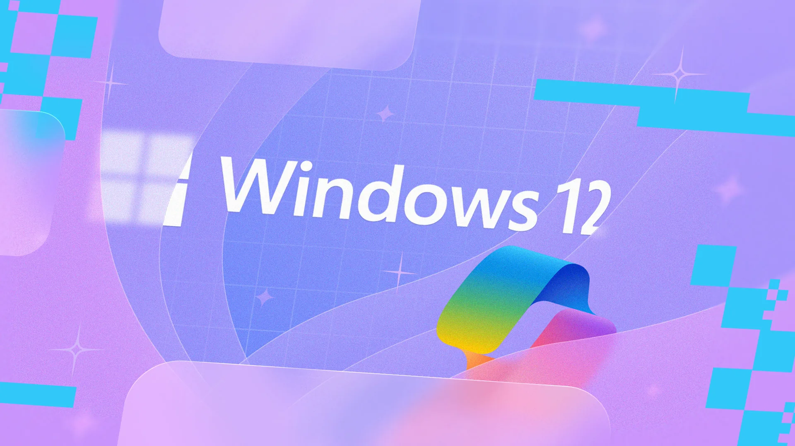

# 🪟 Windows 12 Fan Edition

> A fan-made concept and customization project inspired by what a future version of Windows could look like.



## 🚀 About

Windows 12 Fan Edition is a community-driven concept project designed to explore new ideas, modern UI improvements, productivity features, and futuristic experiences that could inspire the next generation of desktop operating systems.

⚠️ **Disclaimer:** This project is not affiliated with, endorsed by, or associated with Microsoft in any way. Windows is a trademark of Microsoft Corporation.

---

## ✨ Features

* 🎨 Modern and redesigned user interface
* 🌙 Enhanced Dark Mode
* ⚡ Faster and cleaner user experience
* 🧠 AI-inspired productivity tools
* 🖥️ Improved desktop customization
* 📂 Refined File Explorer concepts
* 🔒 Security-focused design ideas
* 📱 Better cross-device integration concepts

---

## 📸 Screenshots

Add screenshots of your project here.

```text
/screenshots
├── desktop.png
├── start-menu.png
├── settings.png
└── explorer.png
```

---

## 🛠️ Installation

### Option 1: Download Release

1. Go to the Releases section.
2. Download the latest package.
3. Follow the installation instructions.

### Option 2: Clone Repository

```bash
git clone https://github.com/USERNAME/windows12-fan-edition.git
cd windows12-fan-edition
```

---

## 📋 Requirements

* Windows 10 / Windows 11
* 4 GB RAM or higher
* Modern x64 Processor
* Administrator privileges (if required)

---

## 🤝 Contributing

Contributions are welcome!

If you'd like to improve the project:

1. Fork the repository
2. Create a feature branch
3. Commit your changes
4. Open a Pull Request

---

## 🐞 Bug Reports

Found an issue?

Please open an Issue and include:

* Operating system version
* Steps to reproduce
* Expected behavior
* Screenshots (if applicable)

---

## 🗺️ Roadmap

* [ ] New Start Menu Concepts
* [ ] Dynamic Widgets
* [ ] AI Assistant Integration
* [ ] Advanced Theme Engine
* [ ] Enhanced Taskbar
* [ ] Virtual Desktop Improvements

---

## ❤️ Credits

### Redistributed By

👤 **Faidul Islam**

### Creator

👤 **lttthedev**

### Special Thanks

* 🌟 Community contributors
* 💡 UI/UX designers
* 🧪 Testers and feedback providers

---

## 📜 License

This project is released under the MIT License.

See the `LICENSE` file for details.

---

## ⭐ Support

If you like this project:

⭐ Star the repository

🍴 Fork it

📢 Share it with others

---

### "Imagining the future, one desktop at a time." 🪟✨
